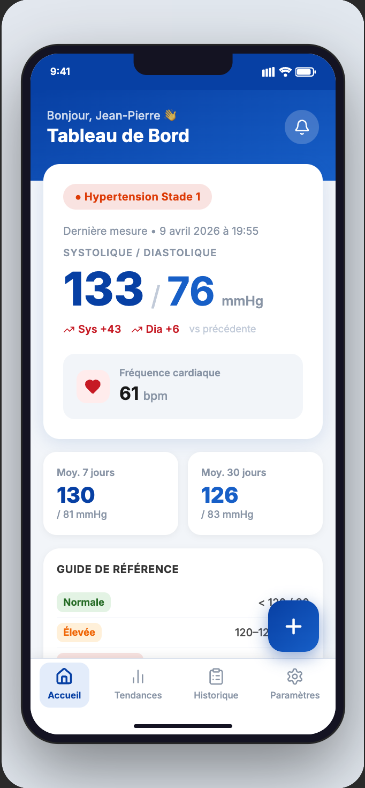
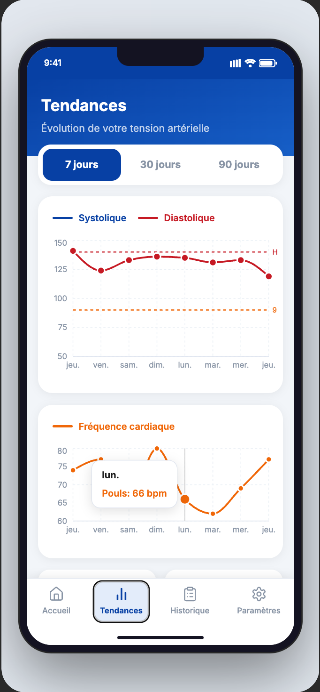
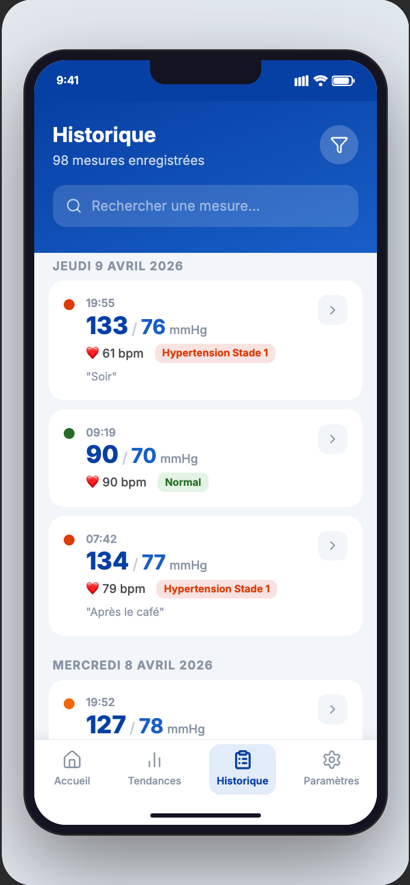
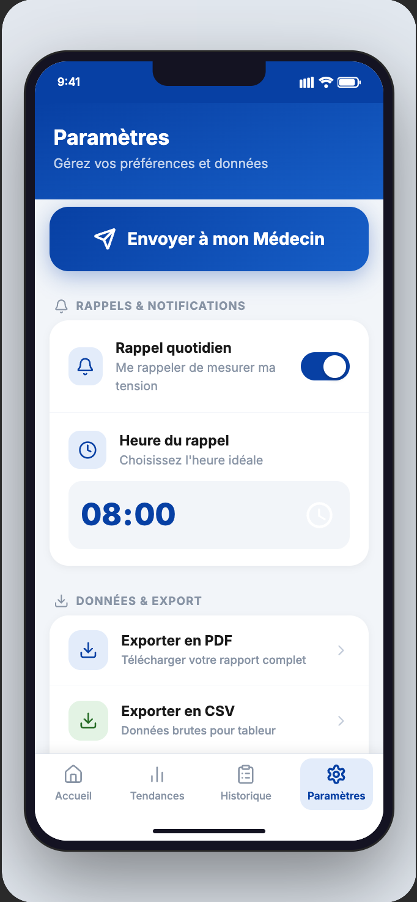

# App Tensionnel Android

Une application Android intuitive et accessible conçue pour aider les patients hypertendus (et leurs aidants) à suivre quotidiennement leur santé cardiovasculaire.

## Objectifs du Projet
L'objectif principal est de simplifier la saisie et le suivi de la tension artérielle pour un public senior ou non technophile. L'interface privilégie la lisibilité avec de grands boutons, des contrastes clairs et une navigation simplifiée.

## Aperçu de l'interface (Maquettes)

| Accueil & Saisie | Tendances & Graphiques | Historique des mesures | Paramètres |
|:---:|:---:|:---:|:---:|
|  |  |  |  |
| *Saisie simplifiée* | *Suivi visuel* | *Gestion des données* | *Rappels personnalisés* |

---

## Fonctionnalités Principales

### 1. Gestion Multi-Profils
- Créez plusieurs profils pour suivre la santé de différents membres de la famille.
- Personnalisation de l'avatar par couleur et ajout d'informations physiologiques (âge, poids, taille).

### 2. Saisie des Mesures
- Enregistrement rapide : Tension Systolique, Diastolique et Pouls.
- **Règles métier & Alertes :**
  - **Alerte Critique :** Popup immédiat + vibration si Systolique > 180 ou Diastolique > 120.
  - **Alerte Vigilance :** Notification visuelle si le pouls est anormal (< 50 ou > 120 bpm).
- Ajout de notes optionnelles pour contextualiser la prise (ex: "Après effort").

### 3. Suivi & Graphiques (MPAndroidChart)
- Visualisation de l'évolution sous forme de courbes.
- Filtres temporels : 7 jours, 30 jours ou 90 jours.
- Calcul automatique des moyennes de tension et de pouls sur la période sélectionnée.

### 4. Historique & Gestion
- Liste exhaustive de toutes les mesures du profil actif.
- Suppression facile via un geste de balayage (swipe-to-delete).
- Édition d'une mesure existante par appui simple.

### 5. Export & Partage de Rapports
- **Rapport PDF :** Génération d'un document professionnel prêt à être envoyé au médecin.
- **Format CSV :** Export des données brutes pour une utilisation dans un tableur (Excel, Google Sheets).
- Partage direct via Email, WhatsApp, etc.

### 6. Rappels & Personnalisation
- Système de notifications quotidiennes programmables.
- **Mode Sombre :** Support complet du thème sombre pour un confort visuel accru.
- Générateur de données fictives pour tester l'application instantanément.

---

## Caractéristiques Techniques
- **Interface :** Jetpack Compose (Material 3)
- **Langage :** Kotlin
- **Persistance des données :** SharedPreferences (Stockage JSON local)
- **Bibliothèque graphique :** MPAndroidChart
- **Tâches de fond :** WorkManager pour la planification des rappels.
- **Confidentialité :** Fonctionnement 100% hors ligne. Aucune donnée personnelle n'est collectée ou transmise à des serveurs tiers.

## Procédure d'Installation
1. Cloner le dépôt : `git clone https://github.com/RayanBT/App_Tensionnel_Android.git`
2. Ouvrir le projet dans **Android Studio Ladybug (ou plus récent)**.
3. Synchroniser les dépendances Gradle.
4. Exécuter l'application sur un terminal Android (Min SDK 24 / Android 7.0+).

---
*Projet réalisé dans le cadre du module Mobile - E4 Ecole d'Ingénieur.*
